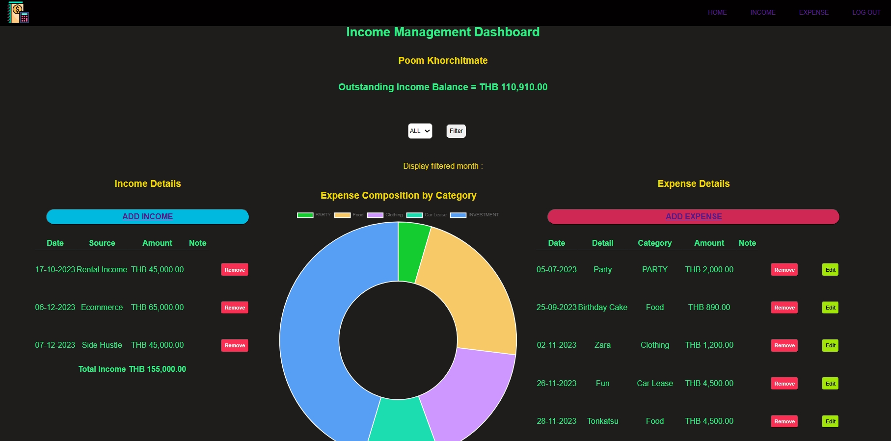

# Income Management App

### Income Management App

This income management app allows user to keep track of personal income and expense as well as customizing expense category. This will help you keep track of your personal income as well as filtering the activities by month.

## :page_facing_up: About

Technology used includes:

-   Javascript
-   HTML
-   CSS
-   NodeJS
-   Express
-   MongoDB
-   Mongoose
-   ChartJS

## :computer: Getting Started

[Click here](https://income-management-app.onrender.com) to see my live project on render!

## :pencil2: Planning & Problem Solving

-   I first created wireframe for the project to get some visualization
-   then I structure the data by creating ERD diagram to help with data relationship
-   then I create a Trello board to help keep track of the functions and features to accomplish. [Click here](https://trello.com/invite/b/w2eOcCTO/ATTIf77c9fbcf0f8fa395fa8f5ea6f6d0c2565026329/user-stories) to see my Trello board

## :scream: Bugs to fix :poop:

-   :wrench: [**Not Fixed**] when scroll the page down there is 2 steps of overflow scroll
-   :wrench: [**Not Fixed**] when scroll the page down there is 2 steps of overflow scroll

## :sob: Lessons learnt

I would be more mindful about CRUD and try to fully implement them first. As well as try to make sure you understand the structure of the database before.

## :white_check_mark: Future features

ICE BOX Features

-   confirm delete button
-   more charts
-   responsive display
-   add budget allocation function
-   log-in via facebook
-   add receipt image to the transaction
-   OCR receipt to text and prefil data for user

# SAVE THE DAY!!
