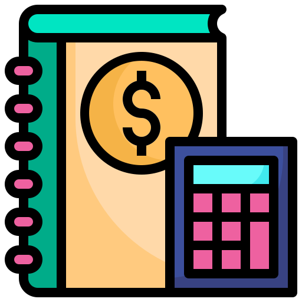

# Income Management App

### Concentration Game

This is a concentration game. Please help match all card in the 36 emoticon's cards.

-   You will only have 3 minutes with 70 attempts each level.
-   The higher the level, the faster the card flip back.

KEEP CONCENTRATE!!

## :page_facing_up: About

Technology used includes:

-   Javascript
-   HTML
-   CSS

## :computer: Getting Started

[Click here](https://poomkhor.github.io/concentration-game/) to see my live project!

## :pencil2: Planning & Problem Solving

-   I first created wireframe for the project to get some visualization
-   then I started by creating an HTML structure first
-   and I wrote my psuedo code below

PSUEDO CODE

1. The game should start whenever there's a click on the card shown on screen
2. The countdown starts
3. The state ('MODEL') of the game will be represented using an array of 36 number with shuffling pairs of number 1-18
4. each number will represent different facial emoticons based on an object schema
5. ('CONTROLLER') first click on the card, the card will flip and then wait for the second card to be flipped then the hang time will start counting --> hang time for each level should also be predetermined
6. check if the number in the game state of the the opened card matches. If not matches setInterval === hangtime, then flip back automatically
7. if matches the imoticons stays opened ('VIEW')
8. continue until either the player found all the matches or times out or attempts been maxed out at 70
9. if found all match, display mssg "You Won, Next Level" and continue to next level with shorter card hang time. If no next level, display mssg "You Made It ALL!, What a GENIUS!! Your Total Score is ${}"
10. if not won, display mssg "You Lose!! Hit Restart Again"

## :scream: Bugs to fix :poop:

-   :wrench: [**FIXED**] if you click more than 2 cards, the next hangtime start counting so you might have less hangtime than you suppose to.

## :sob: Lessons learnt

I would be more careful in planning the psuedo code. What I found when I code based on the initial pseudo code is that there were a lot of step were skipped. This make me have to spend more time on figuring out the step later on and refix it multiple times.

## :white_check_mark: Future features

I would like to add the card flip transition when click using CSS

# PLAY AWAY!!!
